**Scrabble**

**Scrabble game - written in C\# WinForms - Version 2.0**

**What's New?**

**This version includes code improvements, as well as bug fixes.**

**Please see details in the appendix for this document.**

Notice: all additional files - Interop.SpeechLib.dll**,** RightArrow.bmp and

DownArrow.bmp MUST be located in the executable folder (where Scrabble.exe file
is located):

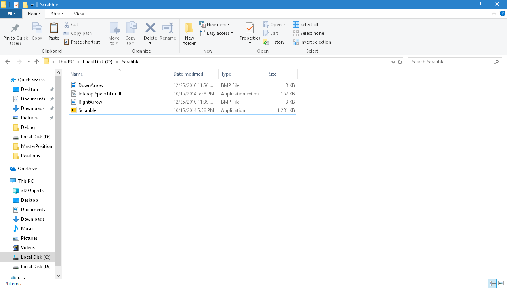

When launching the application, the splash screen is shown

(with different colors every time - added in current version):

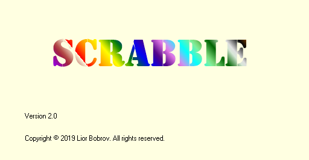

After few seconds, the splash screen is fading out and Options window is shown

after fade-in effect.

Fade effects and new design of Options window - added in current version:

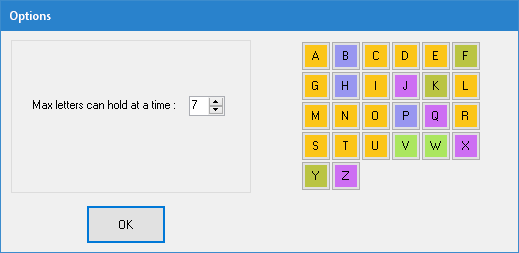

On this screen, we can:

-   Change max. number of letters that the user can have at a time (2 to 15)

-   Hover the mouse over a letter-\> letter's value is shown

-   Click on a letter-\> we can change its value, or select random value for it.

To change the value manually, type a new value (1 to 9999), then press Enter.

After pressing Enter, the letter's color will be changed according to its new
value - added in current version:

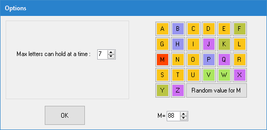

We can change the value of one or more letters, or select random value for them
(the new random value will be between 1 and 9999).

When ready, press "OK" button-\> the main application screen will be shown.

Selecting Max. letters= 15 from Options screen and press "OK"-\> the main screen
is shown as follows:

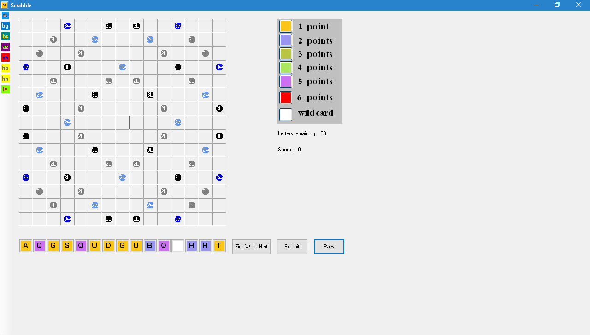

Now, we can:

-   Drag&Drop a word letter-by-letter, from letters surface, to the board.

The first word must occupy the center of the board.

Press "**Submit**" button-\> the word will be displayed, along with its score.

-   If we can't create a legal word from the given letters:

Press "**Pass**" button-\> Pass window will be shown.

From here, we can replace the letters we want, by click on them

(or check the "Select All" checkbox) and press "Pass" button:

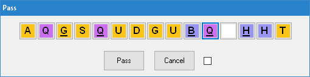

-   Instead of creating the first word manually, we can press the button

"**First Word Hint**" from the main screen.

The application finds the best result(s) for legal word, using the given
letters.

(More than one word can be suggested here)

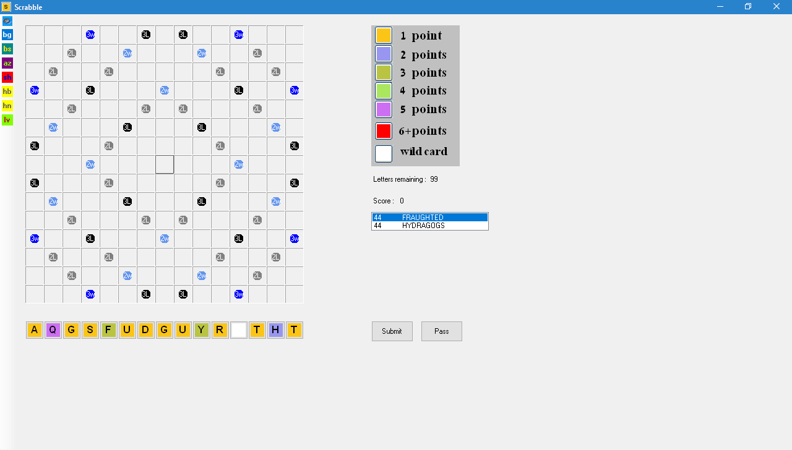

Now, we can select a suggested word, by double-click on the suggestion-\>

the first move is now done.

-   Wild card: a wild is displayed as a white button without a letter on it

(as shown on the screenshot above).

Dragging it to the board, on the square we want-\> Wild card window will be
shown:

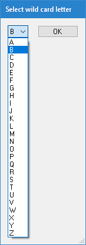

Now, we can select the new letter, either by pressing the wild letter combobox,
or by typing the letter using the keyboard.

Press "OK" button-\> the wild card window will be closed and the wild card will
have the new letter on it. Such wild card letter's value is 0.

-   Playing using the keyboard (instead of mouse Drag&Drop):

click on a square on the board, then press right or down arrow on keyboard-\>

this sets the word's typing direction (right arrow for horizontal, down arrow
for vertical).

In the screenshot below, we can now type a word, which will be shown vertically:

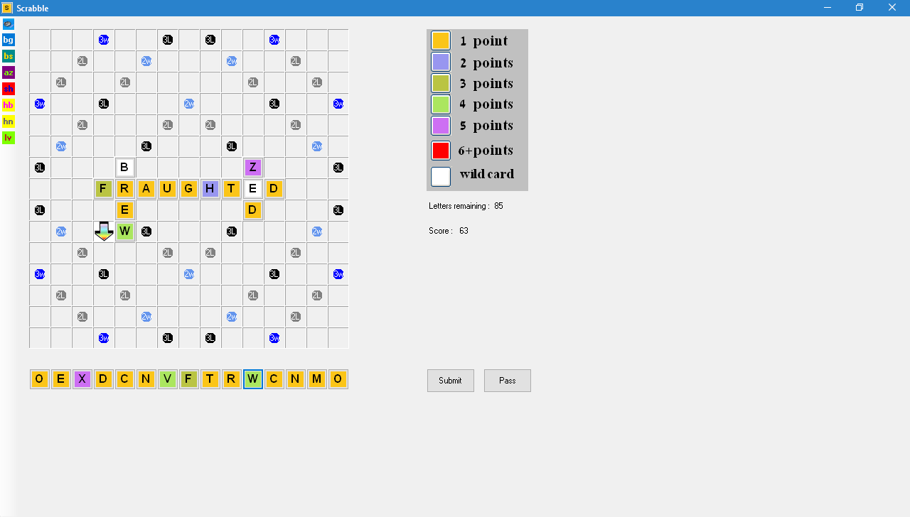

Additional game options buttons:

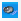

Toggles "Speak Legal Words" ON/OFF.

Changes the board's background color, according to user's choice.

For example, after changing board's background color to green, the

main screen will look like that:

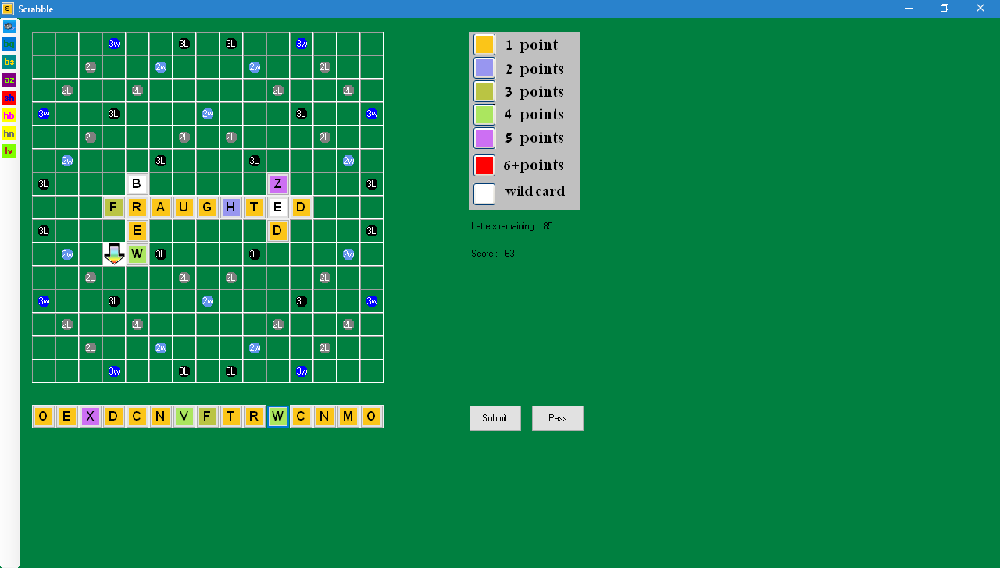

Switches between circle/rectangle bonus shape.

Rectangular bonus squares will look like that:

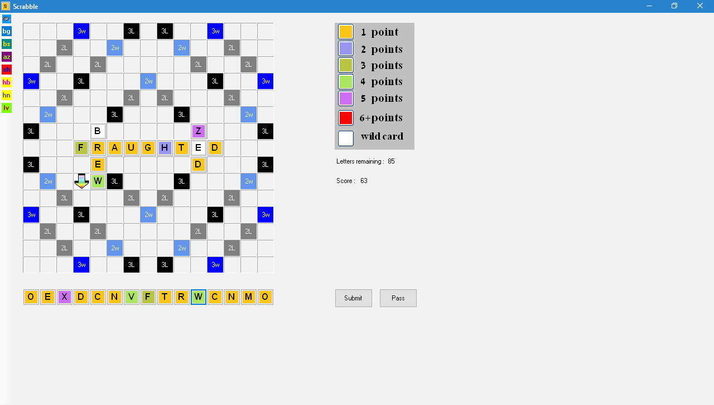

Sorts the letters on letters surface, by ascending/descending order.

Shuffles the letters on letters surface.

Shows the previous move played on board (disabled before first move).

Shows the next move played on board (disabled after last move).

Shows letters values, according to what we set on Options window

(before main screen is shown), or according to default values (if letters

values were not set on Options window):

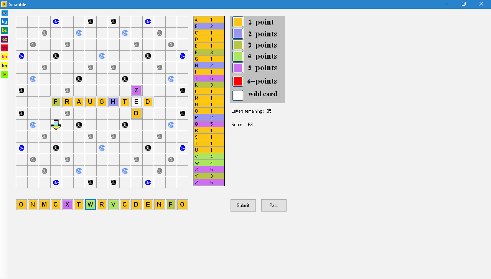

On the next page of this manual, there is a short description of the application
code.

**Code Components**

**frmScrabble.cs:** Here we have application's main code, including calls to
board initialization and communicating with other windows, depending on user's
actions.

<https://github.com/LiorBob/Scrabble-V2.0/blob/master/Scrabble/frmScrabble.cs>

**frmScrabble.Designer.cs:** Actual board initialization, including buttons
letters surface, the board itself including bonus squares, as well as Drag&Drop
logic.

<https://github.com/LiorBob/Scrabble-V2.0/blob/master/Scrabble/frmScrabble.Designer.cs>

**frmSplash.cs** and its designer: The splash screen, after launching the
application.

<https://github.com/LiorBob/Scrabble-V2.0/blob/master/Scrabble/frmSplash.cs>

**frmOptions.cs** and its designer: Deals with Options window (after splash
screen).

<https://github.com/LiorBob/Scrabble-V2.0/blob/master/Scrabble/frmOptions.cs>

**frmPass.cs:** Deals with "Pass" window, where user selects which letters to
replace.

<https://github.com/LiorBob/Scrabble-V2.0/blob/master/Scrabble/frmPass.cs>

**frmWildCard:** Represents Wild card window, shown after Drag&Drop of a wild
card.

<https://github.com/LiorBob/Scrabble-V2.0/blob/master/Scrabble/frmWildCard.cs>

Other parts of the code deal with:

Single letter representation, moves representation and First Word Hint logic.

This is described on the next page.

**Letter.cs:** Represents a single letter, with its properties and methods for
retrieving

its color and points (value).

<https://github.com/LiorBob/Scrabble-V2.0/blob/master/Scrabble/Letter.cs>

**FirstMove.cs:** This class holds the first move logic, including various
validations of the word just put on board.

<https://github.com/LiorBob/Scrabble-V2.0/blob/master/Scrabble/FirstMove.cs>

**NonFirstMove.cs:** This class holds the logic of all moves, except the first.

Here, there are additional validations, including combinations with other,
already-existing words that were put on board.

<https://github.com/LiorBob/Scrabble-V2.0/blob/master/Scrabble/NonFirstMove.cs>

**FirstWordHint.cs:** This class produces the first word hint (from the list of
legal words) and shows it to the user.

<https://github.com/LiorBob/Scrabble-V2.0/blob/master/Scrabble/FirstWordHint.cs>

**Appendix**

**Here, we'll discuss the code improvements, as well as bug fixes, done in this
version.**

**frmScrabble.cs**

-   Added method ReturnWordLettersToSurface:

In case the user played an illegal move, this method returns all the letters of
the new word to their base position; Now, the user has to re-create a word on
the board.

-   The code of the method GetEmptyLabelsLocations was dramatically reduced and
    replaced by a single LINQ statement with extension methods.

-   Method btnPass_Click:

Fixed bug: when there are no letters remaining, pressing "Pass" ends

the game.

-   Method btnFirstWordHint_Click:

Added code for rare case, when all of the letters we have are wild cards.

In this case, The best words list contains all the words which have

length = MAX_LETTERS_CAN_HOLD only

(MAX_LETTERS_CAN_HOLD was set according to Max. Letters in Options window).

The score for each best word is already known: BINGO_BONUS

(which is set at the beginning of frmScrabble.cs).

So in this case, there is no need to call to FirstWordHint class.

Also added code for the other cases, which detects when a word in the original
word dictionary can't be created from the letters we have;

if we have no wild cards, we skip testing the rest of the characters in the
current word, when encountering a character which isn't contained in the letters
we have.

-   Method lstBestWords_DoubleClick:

Fixed bug when we had more than one wild card and we double-clicked on a word
that uses at least one wild card (but less wild cards than the number we have).
Added if statement to solve it:

if (j == lettersDoNotAppearOnButtons.Length) break;

-   Method circleBonusesToolStripButton_Click:

Shortened code by replacing long switch statement with if... else,

due to the added Dictionary\<string, Color\> variable bonusesColors

(this variable is defined in frmScrabble.Designer.cs).

-   Method ProcessCmdKey:

Fixed bug related to playing with keyboard:

now, if we have wild card/s and we type a key on keyboard which has a letter we
already have, the letter we already have will be dragged & dropped on the board
before using the wild card/s.

The wild card/s will be used when typing a letter which we don't have, or all of
its occurrences have already used before.

Also, added the code that if First Word Hint ListBox is displayed and then we
play with the keyboard a word which contains a wild card and the letter we
selected for wild card affects the First Word Hint, then First Word Hint listbox
is updated with the new best words.

*frmScrabble.Designer.cs*

-   Method lblBoardSquares_Paint:

Code was dramatically reduced; instead of calling four methods of bonus drawing
per label, a Dictionary variable bonuses has been added.

A *key* in this dictionary represents all the labels tabindex values, which
contain a bonus; a *value* in this dictionary represents the bonus type

(the bonus types are: 3w, 3L, 2w, 2L).

So only when encountering a label which contains a bonus, DrawBonus method will
be called.

DrawBonus method replaces the four bonus drawing methods, appeared in previous
versions (e.g. version 1.8).

**frmSplash.cs**

-   Added method lblTitle_Paint:

This method creates the Linear gradient "Scrabble" word, with multiple colors,
randomly (out of 20 colors).

-   Added method FadeOut:

After screen loads, wait 3 seconds and the Fade Out effect appears.

This method uses Task.Delay, which requires .NET FW 4.5, so the entire

project was rebuilt and targeted to .NET FW 4.5.

**frmOptions.cs and frmOptions.Designer.cs**

-   Added method FadeIn:

After the Fade Out effect in the splash screen, wait few seconds and the Fade In
effect will be shown in Options window.

-   Method InitializeButtonLetters:

Code was dramatically reduced, due to added Dictionary variable, which holds
list of letters as *keys* and their associated score as *values*.

Also, added the code to show the colorful letters in Options window, when window
loads.

**frmPass.cs**

-   Method btnLetters_Click:

Code was dramatically reduced, due to changing the selecting/deselecting letters
algorithm.

-   Method btnPass_Click:

Used LINQ statement to retrieve the indices of the letters to replace.

>   **Letter.cs**

-   Method SetLettersAttributes:

Code was dramatically reduced, due to adding List\<Color\> variable.

-   Methods GetColor, GetPoints:

Code reduced and uses Find method of List\<T\>.

**FirstMove.cs**

-   Method CheckCenterOccupied:

Code reduced and uses Exists method of List\<T\>.

-   Method GetWordPut:

Code reduced and uses LINQ Select extension method.

**NonFirstMove.cs**

-   Method GetSquareIndex:

Code was dramatically reduced and uses FindIndex method of class System.Array.

-   Method GetWordPoints:

Code reduced inside the switch statement.

**FirstWordHint.cs**

-   FirstWordHint (constructor):

Added code and improved performance of showing the best words for First Word
Hint.

**Cross-Project changes**

-   Replaced lines of the form:

wordPutOnBoard.Sort(delegate(Button b1, Button b2) { return
b1.Location.X.CompareTo(b2.Location.X); });

with the shorter form:

wordPutOnBoard.Sort((b1, b2) =\> b1.Location.X.CompareTo(b2.Location.X));

-   Used property initializers to reduce code

-   Removed unnecessary Using statements (with the help of Visual Studio 2017)

-   Removed unnecessary references from project
